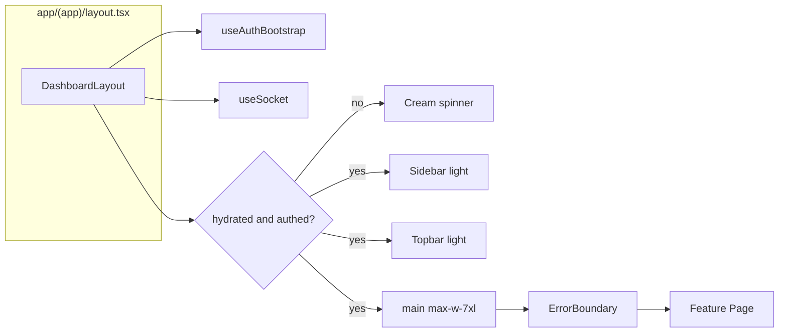
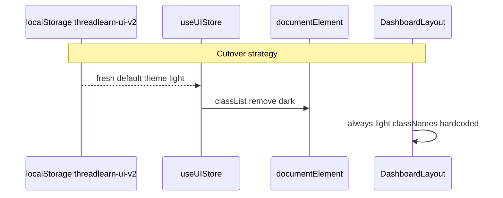
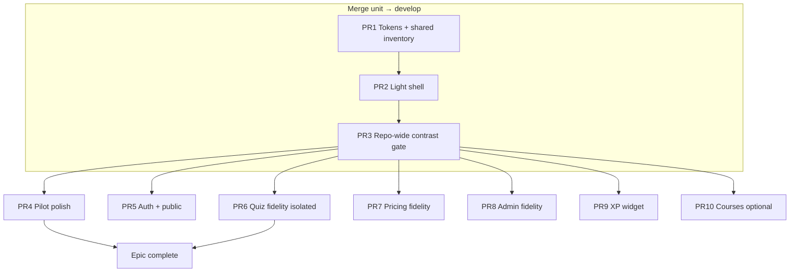

# Design: Full White/Light Theme Reskin (Demo Visual Language + Integrated FE Skeleton)

| Field | Value |
|-------|--------|
| **Document** | ThreadLearn FE — Full Light Theme & Layout Alignment |
| **Author** | Dev4 / FE (placeholder) |
| **Date** | 2026-07-13 |
| **Status** | **In progress** — PR1–PR5 implemented on feature branch (design review approved) |
| **Base branch** | `feat/dev4-ui-reskin-pilot-demo-pages` |
| **Visual reference** | `origin/refactor/fe-next-demo-flow` → `DemoAppShell` + `Demo*Page` |
| **Related docs** | `docs/DEV4_FE_PROTECTED_SURFACE.md`, `docs/DEV4_UI_RESKIN_PILOT.md` |
| **Last progress update** | 2026-07-13 — PR6 landed |

### Implementation progress (PR tracker)

| PR | Scope | Status | Commit(s) on branch | Test pages |
|----|--------|--------|---------------------|------------|
| **PR1** | Tokens + shared inventory + light toaster/primitives | ✅ **Done** | `b686428` (merge unit) | — |
| **PR2** | Light shell (`DashboardLayout` / Sidebar / Topbar), nav, stats | ✅ **Done** | `b686428` (merge unit) | Any authed page shell |
| **PR3** | Repo-wide contrast bridge | ✅ **Done** | `b686428` (merge unit) | Quiz/pricing/admin readable |
| **PR4** | Pilot layout polish vs `Demo*Page` | ✅ **Done** | `606faeb` | **`/dashboard`**, **`/leaderboard`**, **`/quiz/history`** |
| **PR5** | Auth light + root cream cutover | ✅ **Done** | `75705ca` | **`/login`**, **`/register`**, **`/forgot-password`**, **`/403`**, **`/not-found`** |
| **PR6** | Quiz take + attempt detail fidelity (timer safe) | ✅ **Done** | `215c5cf` | **`/quiz/[lessonId]`**, **`/quiz/attempts/[id]`** |
| **PR7** | Pricing / payment fidelity | ⬜ Pending | — | `/pricing`, callback, mock VNPay |
| **PR8** | Admin quizzes & plans fidelity | ⬜ Pending | — | `/admin/quizzes`, `/admin/plans` |
| **PR9** | XP widget / profile fidelity | ⬜ Pending | — | `/profile` |
| **PR10** | Courses / lessons demo fidelity (Dev4 owns after PR6–9) | ⬜ Pending | — | `/courses`, `/lessons/[id]` |

**Note:** PR1–PR3 shipped as one merge-unit commit (`b686428`). PR4 is separate (`606faeb`). Pilot seed before merge unit: `165ff26`.

---

## Overview

ThreadLearn’s integrated Next.js 15 FE currently ships a **dark product chrome** (`DashboardLayout` / `Sidebar` / `Topbar` on `#0a0a0f` / `#0d0d14`, violet mono accents) while the Dev4 pilot already reskinned **page content** for `/dashboard`, `/leaderboard`, and `/quiz/history` into the **demo light language** (cream canvas, white cards, black ink, lime/pink/blue pills, framer-motion). The result is a **mixed theme**: dark shell + light page cards — hard to maintain, visually inconsistent, and awkward to fix layout/spacing against the demo reference.

This design proposes a **full white/light theme always** for the authenticated app (and aligned auth/public entry surfaces), by **porting `DemoAppShell` visuals into the existing shell** rather than swapping to demo routes or mock data. API handling, error/retry UX, `useAuthBootstrap`, `useSocket`, role guards, and Dev4 protected surfaces stay on the current integrated skeleton.

**One-liner:** Demo = skin reference. Current = skeleton + data layer. Full light reskin = one design system on that skeleton, end-to-end.

**Chrome rule (product language):** App chrome + page canvas are always cream/white. Dark is allowed only for **intentional hero islands** (`#111827`), **black CTAs**, and **black active nav** — never reintroduce full-page dark backgrounds “for contrast.”

---

## Background & Motivation

### Current state (as of pilot branch)

| Layer | Implementation | Theme |
|-------|----------------|-------|
| App layout | `app/(app)/layout.tsx` → `DashboardLayout` | Dark canvas (hardcoded hex) |
| Shell | `src/layouts/DashboardLayout.tsx`, `Sidebar.tsx`, `Topbar.tsx` | `#0a0a0f` / `#0d0d14`, violet accents; **hardcoded**, not `dark:` variants |
| Tokens | `tailwind.config.js` + `src/styles/globals.css` | Dark `canvas`, `surface`, **violet** `accent-*`, mono UI classes |
| Pilot pages | `DashboardPage`, `LeaderboardPage`/`LeaderboardContent`, `QuizHistoryPage` | Light demo cards (`#111827` heroes, white tables, `#d9f99d` streak) |
| Unmigrated Dev4 | `QuizPage`, `QuizAttemptDetailPage`, `Pricing*`, `AdminQuiz*`, `AdminPlan*`, `XpLevelStreakWidget` | Still light-on-dark (`text-gray-100`, `bg-surface`, violet chips) |
| Helpers | `src/features/ui-reskin/demo-ui.tsx` | `DemoPill`, `UI_PLACEHOLDERS` (UI-only) |
| Demo reference | `src/features/demo/DemoAppShell.tsx`, `pages.tsx` | Cream shell `#f7f4ee`, white nav, black active item |
| Auth / public | `LoginPage`, `RegisterPage`, `PasswordPages`, `app/page.tsx`, `app/403` | Still dark-oriented |
| Shared primitives | `src/components/shared/index.tsx` (`Button`, `Input`, `Card`, `Badge`, `EmptyState`, `CourseCard`, `Avatar`…) | Dark-oriented classes |
| Global chrome | `Providers.tsx` Toaster (`#111118`), `ErrorBoundary`, admin layout violet spinner | Dark-oriented |
| Theme store | `useUIStore.theme` default `'dark'`, Topbar Sun/Moon toggle | **Intended** dual-theme field; **not a working product theme** — shell uses hardcoded hex, and **no `dark:` class variants** exist in the repo |

### Pain points

1. **Mixed theme** — pilot content assumes cream/white parent; shell paints near-black. Cards “float” on the wrong canvas; contrast and section rhythm break.
2. **Harder layout edits** — spacing/hierarchy must be audited against demo *and* compensated for dark chrome. Full light shell makes sections comparable 1:1 to `Demo*Page`.
3. **Token drift** — pilot uses raw hex (`#111827`, `#d9f99d`, `border-black/10`) while shell/globals use violet/surface tokens. Two systems in one tree.
4. **User decision** — team rejects Option A (keep dark shell, light pages only). **Option B from `DEV4_FE_PROTECTED_SURFACE.md` is now the product choice:** light shell ported into `DashboardLayout`, full app light always.
5. **Cutover hazard** — flipping shell to cream without a **repo-wide contrast bridge** leaves Quiz take, Pricing, Admin CRUD, and XP widget unreadable (`text-gray-100` on cream).

### What already works (must preserve)

- `useAuthBootstrap` revalidates session + loads gamification stats into `useAuthStore.stats`.
- `useSocket` for realtime XP / leaderboard events.
- React Query + services: `quizService`, `leaderboardService`, `gamificationService`, `subscriptionService`, etc.
- Error/retry toasts (no fake rank/XP on failure).
- Admin nav (Quizzes, Plans) + `app/(app)/admin/layout.tsx` role guard.
- Quiz take: countdown + auto-submit + access UX on `QuizPage`.

---

## Goals & Non-Goals

### Goals

1. **Single light design system** for authenticated app: cream canvas, white surfaces, black ink, lime/pink/blue accent pills — matching demo visual language.
2. **Shell fidelity** to `DemoAppShell`: white/blur sidebar, cream sticky topbar, black active nav, lime promo/footer panel (without “Demo mode” copy on production).
3. **Page layout fidelity** for reskinned pages: re-audit pilot pages and subsequent Dev4 pages against `Demo*Page` for hierarchy, grids, radius, padding — not palette-only.
4. **Preserve data/auth architecture** on integrated branch; implementable on `feat/dev4-ui-reskin-pilot-demo-pages` without discarding BE wiring.
5. **Align auth pages** (and 403 / not-found) to light language before PR5 global cream flip; grandfathered landing/IDE need no rewrite for acceptance.
6. **Accessibility:** WCAG-oriented contrast on white, `prefers-reduced-motion` retained, focus rings visible on light bg.
7. **Usable cutover:** After shell goes cream, **every** production feature under `src/features/**` must remain readable (ink text + white/cream cards) via a **repo-wide contrast bridge** before develop merge — full demo fidelity can lag.
8. **Phased, reviewable rollout** via ordered PRs (see PR Plan), with an enforceable merge unit.

### Non-Goals

- Backend / NestJS contract changes.
- Rewriting services, types, or API paths.
- **New** wiring of production routes to `Demo*Page` / `demo-data.ts` (shell, Dev4, and other real feature pages stay real).
- **Unwiring or productizing** pre-existing grandfathered demo routes (`/` → `DemoLandingPage`, `/ide` → `DemoIDEPage`) in this epic — see Key Decision 19.
- Replacing business values (XP, rank, score) with mocks on error.
- Building a full dual dark/light product theme (product is **light always**; today’s toggle does not actually theme chrome).
- Full demo layout fidelity for every non-Dev4 page in the minimum epic (courses/lessons may stay “readable but not demo-perfect” until PR10).
- Merging `refactor/fe-next-demo-flow` as base.
- Mobile drawer redesign in the shell PR (desktop-first visual port; keep current always-visible collapsible rail).
- Expanding PR10 / contrast work to “fix IDE” — `/ide` is already demo-light under shell and is not a PR3 contrast blocker.

### Pre-existing demo route inventory (base branch — verified)

| Route | File | Component | Policy this epic |
|-------|------|-----------|------------------|
| `/` | `app/page.tsx` | `DemoLandingPage` (`features/demo/pages` + marketing/`demo-data` copy) | **Grandfather** — already light marketing UI; do not treat as Dev4 reskin target |
| `/ide` | `app/(app)/ide/page.tsx` | `DemoIDEPage` | **Grandfather** — mock IDE; already light; omit from student nav (KD11); not PR3/PR10 scope |
| Shell / Dev4 / courses / auth feature pages | real `*Page` | Real services | **Must stay real** — no new Demo* swaps |

**Epic rule:** forbid **new** production Demo* wiring. Do **not** fail acceptance solely because grandfathered `/` and `/ide` still import from `features/demo/**`.

---

## Proposed Design

### Architecture principle

```
┌─────────────────────────────────────────────────────────────────┐
│  app/(app)/layout.tsx                                           │
│    DashboardLayout  ← KEEP structure (bootstrap, socket, gate)  │
│      Sidebar + Topbar  ← RESKIN to DemoAppShell chrome          │
│      main children     ← light canvas padding                   │
└───────────────────────────────┬─────────────────────────────────┘
                                │
┌───────────────────────────────▼─────────────────────────────────┐
│  Feature *Page  ← KEEP hooks/services/handlers                  │
│    JSX/layout tokens ← Demo*Page visual language                │
│    UI_PLACEHOLDERS only for missing display fields              │
└───────────────────────────────▲─────────────────────────────────┘
                                │ read-only reference
┌───────────────────────────────┴─────────────────────────────────┐
│  features/demo/*  (DemoAppShell, Demo*Page, demo-data)          │
└─────────────────────────────────────────────────────────────────┘
```

**Forbidden:** `app/(app)/layout.tsx` → raw `<DemoAppShell>` without porting bootstrap, socket, admin nav, pricing, collapse, notification badge, real logout.

### Design tokens (light system)

Centralize in `tailwind.config.js` + `globals.css` so pages stop inventing one-off hex where a token exists. Keep raw hex only when matching demo hero blocks already established in pilot (`#111827` ink hero is intentional demo language).

#### Token migration strategy (explicit — do not rename violet `accent` in PR1)

Today production and `globals.css` depend heavily on **violet** `accent-300`…`accent-600`, `bg-accent-500/10`, `ring-accent-500/70`, `shadow-glow`, selection/scrollbar thumb. Remapping or deleting `accent` in one PR breaks contrast on cream (e.g. `text-accent-300` becomes illegible or wrong brand).

| Layer | Strategy |
|-------|----------|
| **Legacy `accent` (violet scale)** | **Keep as-is** through PR1–PR3. Treat as **legacy brand** for code highlights / not-yet-migrated chips. Do **not** delete or remap to brand-lime in PR1. |
| **Global `canvas.DEFAULT` (timing)** | **Do not repoint to cream in PR1.** Today `globals.css` binds `html`/`body` to `theme('colors.canvas.DEFAULT')`. Leaving `canvas.DEFAULT` dark (or pinning `html/body` to `#0a0a0f`) until **PR5** avoids cream bleed around dark auth. |
| **Shell cream token** | Add **new** `canvas.cream` / use `bg-[#f7f4ee]` / `bg-canvas-cream` on `DashboardLayout` and shell surfaces in PR2. |
| **New light tokens** | Add **alongside** legacy: `canvas.cream`, `ink.*`, `hero`, `brand.lime`, `pill.pink` / `pill.blue` / `pill.amber` — **avoid overwriting** Tailwind default `lime` scale and violet `accent` key. |
| **Chrome + globals component classes** | Shell, `.btn-primary`, `.sidebar-item*`, `.card`, `.input-field` move to **black / brand-lime / ink** — stop using violet for product chrome. Soft elevation shadows apply to components (not via global cream body). |
| **Feature pages** | PR3 contrast bridge: replace light-on-dark utilities; **prefer** `text-ink` / `text-black` / `border-black/10` / white cards. Leave isolated `accent-*` only where still readable on cream (or swap to brand-lime/black in same pass if not). |
| **PR5 global cutover** | After auth + 403 + not-found are light: set `html`/`body` to cream + ink, and optionally align `canvas.DEFAULT` → cream so token and root match. |
| **Later cleanup** | Optional PR to remove unused violet chrome. Out of minimum epic. |

**Preferred approach name:** **legacy-accent-keep + additive light tokens + delayed global canvas cream** (no mass `accent` codemod; no PR1 global cream flip).

#### Color tokens (proposed — additive)

| Token | Value | Role / when |
|-------|--------|-------------|
| `canvas.DEFAULT` | **keep `#0a0a0f` through PR1–PR4** | Still feeds `html`/`body` until PR5 — **do not repoint to cream in PR1** |
| `canvas.cream` | `#f7f4ee` | **New** — authenticated shell / app chrome background (PR2+) |
| `canvas.muted` | `#efeae1` | Subtle wells / table header strips (PR1+) |
| `surface.DEFAULT` | `#ffffff` | Cards, sidebar, inputs — **safe to repoint in PR1** (component-level; auth pages hardcode their own dark card bg until PR5) |
| `surface.elevated` | `#ffffff` | Modals/menus |
| `surface.border` | `rgba(0,0,0,0.10)` | Replaces dark `#1e1e2e` border role for light components |
| `ink.DEFAULT` | `#111111` | Primary text on light surfaces (**new**) |
| `ink.muted` | `rgba(0,0,0,0.60)` | Secondary (**new**) |
| `ink.subtle` | `rgba(0,0,0,0.45)` | Labels / uppercase tracking (**new**) |
| `ink.faint` | `rgba(0,0,0,0.35)` | Placeholders (**new**) |
| `hero` | `#111827` | Dark hero panels only (**new** semantic) |
| `brand.lime` | `#d9f99d` | Primary soft accent — class form **`bg-brand-lime`** (**not** top-level `lime`, which would clobber Tailwind’s default `lime-50`…`lime-900` scale) |
| `pill.pink` | `#f5d0fe` | Quiz / soft tags |
| `pill.blue` | `#bfdbfe` | Info / notifications |
| `pill.amber` | `#fde68a` | Course card accents |
| `danger.soft` | `#fecaca` / text `#7f1d1d` | Failed quiz pill |
| **`accent.*` (existing violet)** | unchanged hex scale | **Legacy only** until page-level cleanup |

**PR1 `globals.css` html/body rule (mandatory exception):**

```css
/* PR1–PR4: keep root dark so auth/public full-page dark shells do not cream-bleed.
   Shell uses bg-canvas-cream / #f7f4ee explicitly. PR5 flips root to cream + ink. */
html, body {
  background-color: #0a0a0f; /* or theme('colors.canvas.DEFAULT') while DEFAULT stays dark */
  /* Do NOT set body color to ink until PR5 if auth nodes rely on light gray text inheritance */
}
```

Shell / light components use `bg-canvas-cream`, `bg-white`, `text-ink` explicitly — they do not depend on body cream in the merge unit.

#### Shadow / selection / scrollbar (light elevation)

| Today | After cutover |
|-------|----------------|
| `panel-shadow` / `.panel-shadow` ≈ `rgba(0,0,0,0.5)` | Soft light elevation: `0 4px 24px rgba(0,0,0,0.08)` (or `0 1px 3px rgba(0,0,0,0.08), 0 8px 24px rgba(0,0,0,0.06)`) — for light cards/modals |
| `shadow.glow` violet | Soft black/`brand-lime` glow or drop; do not keep strong violet bloom on cream shell |
| `::selection` violet + white | Prefer black text on `#d9f99d` once shell is light; may stay violet on dark root until PR5 |
| Scrollbar thumb `accent.500` | On light surfaces: `rgba(0,0,0,0.2)` hover `rgba(0,0,0,0.35)`; root can stay accent until PR5 |

#### `.btn-primary` vs `Button variant="primary"` (must not diverge)

| Surface | Target classes |
|---------|----------------|
| `globals.css` `.btn-primary` | `bg-black hover:bg-black/90 text-white rounded-full` (student CTAs) / allow `rounded-lg` via modifier if needed |
| `Button` `variant="primary"` | **Same visual language:** `bg-black hover:bg-black/90 text-white` (not `bg-accent-600`) |
| `Button` `variant="outline"` / `ghost` | Light borders / ink muted — rewrite `variantClasses` in `shared/index.tsx` in the same PR as globals |
| Focus rings | `focus-visible:ring-black/30` + `ring-offset-[#f7f4ee]` (not `ring-accent-500/70` on chrome) |

PR1 greps for `btn-primary` and `variant="primary"` / `variant='primary'` to keep parity.

#### Typography (decided for implementability)

| Phase | Rule |
|-------|------|
| **PR2 (shell)** | **Remove forced `font-mono` from Sidebar/Topbar/nav labels.** Keep JetBrains Mono via CSS variable for code/IDE and optional dense inputs. No new font package. |
| **PR4 (pilot polish)** | Keep/ensure display headings `text-4xl font-light tracking-tight` as already on pilot pages. |
| **Later** | Optional Inter/Geist — out of minimum epic. |

#### Component class map (`globals.css`)

Rewrite utility components from dark to light:

| Class | Light behavior |
|-------|----------------|
| `.btn-primary` | See table above — black CTA, aligned with `Button` primary |
| `.btn-ghost` | `text-black/60 hover:bg-black/[0.05] hover:text-black` |
| `.btn-outline` | `border border-black/10 bg-white hover:bg-black/[0.03]` |
| `.input-field` | `bg-white border-black/10 text-ink placeholder:text-black/35 focus:ring-black/10` |
| `.card` | `bg-white border border-black/10 rounded-lg` + soft shadow (not heavy panel) |
| `.sidebar-item` | `text-black/60 hover:bg-black/[0.05] hover:text-black rounded-lg` |
| `.sidebar-item-active` | `bg-black text-white` (no violet border) |
| `.skeleton` | `bg-black/[0.06] animate-pulse` |
| Badges (globals + shared) | purple/violet chips → black/lime soft on white; green→lime; red→soft rose; amber→soft amber |

Expand `demo-ui.tsx` (PR1 or PR2):

- Export token-aligned constants: `HERO_BG = 'bg-[#111827]'` / `bg-hero`, section wrappers.
- Keep `DemoPill`, `UI_PLACEHOLDERS`, `formatXp` / `formatPercent`.

### Shell redesign (core)

#### `DashboardLayout.tsx`

**Keep:**

```ts
useAuthBootstrap();
useSocket();
// hasHydrated + isAuthenticated redirect → /login
// ErrorBoundary around children
```

**Change:**

| Concern | Today | Target |
|---------|-------|--------|
| Root bg | `bg-[#0a0a0f]` | `bg-canvas-cream` / `bg-[#f7f4ee]` (shell only — not via body) |
| Auth gate spinner | violet on dark | black ring on cream (match `DemoAppShell`) |
| Main padding | `pt-14` + `p-6 max-w-7xl` | Align closer to demo: sticky header `h-16`, main `px-4 py-6 sm:px-6 sm:py-8 max-w-7xl` |
| Sidebar width offsets | `pl-56` / `pl-14` | **Lockstep** with Sidebar + Topbar (see width section) |

#### Sidebar width triple lockstep (PR2 hard requirement)

Today widths are tightly coupled and **must change together**:

| Surface | Expanded | Collapsed |
|---------|----------|-----------|
| `Sidebar` | today `w-56` → target `w-64` (demo) | `w-14` **unchanged** (demo has no collapse — keep) |
| `Topbar` | `left-56` → `left-64` | `left-14` |
| `main` | `pl-56` → `pl-64` | `pl-14` |

**Implementation rule:** introduce a single source of truth in PR2, e.g.:

```ts
// src/layouts/shell-metrics.ts (or constants at top of DashboardLayout)
export const SIDEBAR_EXPANDED_CLASS = 'w-64';      // 16rem
export const SIDEBAR_COLLAPSED_CLASS = 'w-14';     // 3.5rem
export const MAIN_EXPANDED_PL = 'pl-64';
export const MAIN_COLLAPSED_PL = 'pl-14';
export const TOPBAR_EXPANDED_LEFT = 'left-64';
export const TOPBAR_COLLAPSED_LEFT = 'left-14';
```

Alternatively CSS variables on the shell root:

```css
--sidebar-w: 16rem;
--sidebar-w-collapsed: 3.5rem;
```

**Partial edits that update only Sidebar width are invalid PR2.** Reviewers reject if Topbar/main offsets drift.

#### Mobile shell (decided — desktop-first)

| Choice | Detail |
|--------|--------|
| **PR2 scope** | **Keep always-visible collapsible rail** (`w-14` / `w-64`). Do **not** port `DemoAppShell`’s `hidden lg:flex` without a replacement nav path. |
| **Known gap** | Demo uses mobile logo in header + hidden sidebar; production stays denser on small screens. Document as accepted mobile gap. |
| **Follow-up** | Optional later PR: drawer + hamburger — out of light-theme epic. |

Mermaid — shell composition:



#### `Sidebar.tsx`

Port visual from `DemoAppShell` **while keeping** real nav + admin block:

| Element | Demo | Production shell target |
|---------|------|-------------------------|
| Aside | `bg-white/85 backdrop-blur-xl border-black/10 w-64` | Same expanded; collapsed `w-14` icon-only |
| Logo | Black square + Zap + “ThreadLearn” | Same (drop violet gradient) |
| Active item | `bg-black text-white` | Same |
| Inactive | `text-black/60 hover:bg-black/[0.05]` | Same |
| Footer | Lime “Demo mode” card | User avatar block (existing) and/or real `user.planType` promo — **never** “Demo mode” |
| Admin | N/A in demo | Keep Admin divider + Quizzes/Plans/etc.; `border-black/10`, label `text-black/45 uppercase tracking-widest` |
| Student nav | Quiz Attempts in demo | **Must add** `/quiz/history` and `/pricing` (Key Decision 11) |
| IDE | Demo has Code IDE | **Omit** from student nav in this epic (route `/ide` still reachable by URL; IA inconsistency with demo is intentional to avoid scope creep) |

**Student nav order (decided):**

1. Dashboard (`/dashboard`)  
2. Courses (`/courses`)  
3. Quiz Attempts (`/quiz/history`)  
4. Leaderboard (`/leaderboard`)  
5. Pricing (`/pricing`)  
6. AI / Bookmarks / Notifications / Profile (existing)

**Active-state rules (PR2):**

| Route | Active nav item |
|-------|-----------------|
| `/quiz/history`, `/quiz/attempts/*` | **Quiz Attempts** |
| `/quiz/[lessonId]` (take quiz) | **None** of Attempts — do not use naive `startsWith('/quiz')` on the Attempts item |
| `/pricing`, `/pricing/*` | **Pricing** |
| `/admin`, `/admin/*` | Matching admin item (`/admin` exact for Analytics; prefix for nested except avoid double-active) |

Implementation sketch for Attempts:

```ts
const isQuizAttemptsActive =
  pathname === '/quiz/history' ||
  pathname.startsWith('/quiz/history/') ||
  pathname.startsWith('/quiz/attempts/');
// NOT pathname.startsWith('/quiz')
```

#### `Topbar.tsx`

Port from demo header:

- Sticky/fixed bar: `border-b border-black/10 bg-[#f7f4ee]/90 backdrop-blur-xl` + **lockstep** `left-*` with sidebar width
- Search: rounded-full white field, black/45 placeholder (keep Enter → `/courses?search=`)
- Notifications: white circle button + unread badge (black or lime, not violet)
- User: keep **avatar + dropdown** with light menu `bg-white border-black/10` soft shadow
- Logout: `logout()` → `/login`
- **Theme toggle:** **remove** from UI (not dual-theme product)
- **Level display (required):** bind to `useAuthStore(s => s.stats)` — show `Lv. {stats?.level ?? 1}`; optionally XP if room. On missing/error stats, show fallback `1` / hide XP — **never invent** fake XP totals. Bootstrap already loads stats via `gamificationService.getStats()`.

#### Theme / hydration

**Fact check:** `toggleTheme` flips `document.documentElement` `dark` class, but shell/pages use **hardcoded** dark hex and there are **zero** `dark:` Tailwind variants in the repo. Removing the toggle removes a non-functional control, not a working dual theme.

**Chosen migration (Key Decision 12):**

1. Bump persist key: `threadlearn-ui` → `threadlearn-ui-v2`  
2. Default `theme: 'light'`  
3. On hydrate, always `document.documentElement.classList.remove('dark')`  
4. Remove Topbar Sun/Moon control  
5. `toggleTheme` / `setTheme` may remain as no-ops or light-only setters for API stability — do not reintroduce dark chrome  



**SSR/hydration notes (Next.js 15 App Router):**

- Shell remains `'use client'`. Hardcode light classes; do not branch chrome on `theme`.
- `hasHydrated` auth gate remains; spinner cream (`bg-canvas-cream`).
- **Canvas scoping (Key Decision 16) — coherent PR1 rule:**
  1. **PR1:** Add `canvas.cream` (`#f7f4ee`). **Keep** `canvas.DEFAULT` dark (`#0a0a0f`). Pin `html`/`body` background to dark (via DEFAULT or hardcoded `#0a0a0f`). Do **not** set global body text to ink yet.
  2. **PR2:** `DashboardLayout` / shell use `bg-canvas-cream` (or `#f7f4ee`) explicitly — cream is **shell-scoped**, not body-scoped.
  3. **PR1–PR4:** Auth pages keep their own full-page dark backgrounds; grandfathered `/` (`DemoLandingPage`) already paints its own light marketing canvas.
  4. **PR5:** Restyle Login/Register/Password + `app/403` + `not-found` to light; **then** flip `html`/`body` to cream + ink and optionally repoint `canvas.DEFAULT` → cream so root and token agree.
  5. Landing (`app/page.tsx`): **grandfather** `DemoLandingPage` — already light; PR5 does **not** require rewriting it unless doing a non-demo real landing (out of scope).

### Shared components & global chrome inventory

PR1 (primitives) **must** include more than Button/Input/Card:

| File / export | Action |
|---------------|--------|
| `shared/index.tsx` — Button, Input, Card, Badge, Skeleton, Spinner | Light variants; Button primary = black |
| `shared/index.tsx` — **EmptyState**, **CourseCard**, **Avatar** | Ink text, white/cream wells, borders `black/10` |
| `shared/Modal.tsx` | Light surface; title `text-ink` not `text-gray-100` |
| `components/shared/ErrorBoundary.tsx` | Light error panel (`text-ink`, white card) |
| `components/providers/Providers.tsx` — **Toaster** | Light toast style (see below) — **closes former open Q** |
| `app/(app)/admin/layout.tsx` | Spinner `border-black/30 border-t-black` (not violet) |

**Sonner / toast (decided):**

```ts
// Providers.tsx — target style
toastOptions={{
  style: {
    background: '#ffffff',
    border: '1px solid rgba(0,0,0,0.10)',
    color: '#111111',
    fontFamily: '…',
    fontSize: '13px',
  },
}}
```

Optional: `theme="light"` if using Sonner’s theme prop. Verify error toasts remain readable (rose text ok on white).

### Pilot page polish (after white shell + contrast bridge)

Once shell is cream and contrast bridge landed, re-audit:

| Page | Demo reference | Polish focus |
|------|----------------|--------------|
| `DashboardPage` | `DemoDashboardPage` | Grid `lg:grid-cols-[1.45fr_0.55fr]`, hero `#111827`, lime streak, 3 stat cards, courses + aside |
| `LeaderboardPage` + `LeaderboardContent` | `DemoLeaderboardPage` | Dark hero + white table; current-user row `bg-[#d9f99d]/45`; error/retry on white |
| `QuizHistoryPage` | `DemoQuizHistoryPage` | Pink pill hero; cream table header strip; pass/fail pills |

Do **not** reintroduce mock activity/XP when API fails.

### Phased page rollout

**Phase ↔ PR map (same workstream; use PR numbers in commits/PR titles to avoid off-by-one):**

| Phase (legacy label) | **PR** | Surfaces |
|----------------------|--------|----------|
| P0 | **PR1** | Tokens + globals + **full shared inventory** + soft shadows (`canvas.cream` additive; `canvas.DEFAULT` stays dark) |
| P1 | **PR2** | Shell: DashboardLayout / Sidebar / Topbar + width lockstep |
| P2 | **PR3** | **Repo-wide contrast bridge** |
| P3 | **PR4** | Pilot polish: dashboard, leaderboard, quiz history |
| P4 | **PR5** | Auth + 403 + not-found light; **then** global `html/body` cream |
| P5 | **PR6** | Quiz take + attempt detail **demo fidelity** (**High** — timer) |
| P6 | **PR7** | Pricing / payment fidelity |
| P7 | **PR8** | Admin quizzes / plans fidelity |
| P8 | **PR9** | XP widget / profile gamification polish |
| P9 (optional) | **PR10** | Courses / lessons full demo fidelity |

Prefer saying “PR3 contrast bridge” not “P2” in implementation notes.

### Repo-wide contrast bridge (merge gate)

**After shell is cream, no develop merge without this pass.**

**Goal:** ink text + white/cream cards everywhere production users land. **Not** full demo layout.

**Method:** grep-driven across `src/features/**`, `src/components/**`, `app/**`:

```text
text-gray-100, text-gray-200, text-gray-300
bg-surface, bg-surface-muted, bg-[#0a0a0f], bg-[#0d0d14], bg-[#111118]
border-white/10, border-white/[0.06], border-white/[0.07]
bg-white/5, hover:bg-white/5
text-accent-300, text-violet-*  (on cream — fix if low contrast)
```

**Must include Dev4 (not only courses):**

| Area | Files |
|------|--------|
| Quiz | `QuizPage.tsx`, `QuizAttemptDetailPage.tsx` (history already pilot-light) |
| Subscription | `PricingPage.tsx`, `PricingPlans.tsx`, `PaymentResultPage.tsx`, mock payment UI |
| Admin | `AdminQuizManagementPage.tsx`, `AdminQuizForm.tsx`, `AdminPlanManagementPage.tsx`, `AdminDashboardPage.tsx`, users/courses stubs |
| Gamification | `XpLevelStreakWidget.tsx` |
| Other | `CoursesPage`, `CourseDetailPage`, `lessons/pages.tsx`, `BookmarksPage`, `NotificationsPage`, `AIPage`, `Profile*` |
| Shared already in PR1 | EmptyState, CourseCard, Modal, ErrorBoundary, Toaster |

**Interim vs fidelity:**

| Layer | Contrast bridge (PR3) | Later fidelity PR |
|-------|----------------------|-------------------|
| Quiz take | Readable form, timer visible, black CTA | PR6 demo layout |
| Pricing / admin | Readable tables/cards | PR7/PR8 polish |
| XP widget | Readable numbers | PR9 layout |

Full demo fidelity for PR6–PR9 remains; PR3 makes those routes **usable** immediately.

### Layout patterns (shared page structure)

```tsx
// Pattern: PageHero (light)
<section className="rounded-lg bg-white p-6 sm:p-8 border border-black/5 shadow-sm">
  <DemoPill tone="pink">…</DemoPill>
  <h1 className="mt-5 text-4xl font-light tracking-tight">…</h1>
  <p className="mt-3 text-black/60">…</p>
</section>

// Pattern: PageHero (ink island only)
<section className="rounded-lg bg-[#111827] p-6 text-white sm:p-8">…</section>

// Pattern: Data table shell
<div className="overflow-hidden rounded-lg border border-black/10 bg-white">…</div>

// Pattern: Primary CTA
<button className="rounded-full bg-black px-5 py-2.5 text-sm font-medium text-white">…</button>
```

Motion: keep `framer-motion` on pilot; honor `prefers-reduced-motion`; prefer `useReducedMotion` on new animations.

### Dev4 protected surface constraints (unchanged)

From `DEV4_FE_PROTECTED_SURFACE.md` — still lock:

- Services/types/API paths for quiz, gamification, leaderboard, subscription  
- Routes under `/quiz/*`, `/leaderboard`, `/pricing*`, `/admin/quizzes`, `/admin/plans`  
- Shell behavior: bootstrap, socket, admin guard  
- Never **newly** production-wire `features/demo/**` onto Dev4/shell/feature routes  

**Grandfathered exceptions (already on base branch; Key Decision 19):**

- `app/page.tsx` → `DemoLandingPage`  
- `app/(app)/ide/page.tsx` → `DemoIDEPage`  

These may remain for this epic. Do not expand exceptions. Do not use them as precedent to swap Quiz/Leaderboard/Pricing/Admin to Demo*.

UI-only placeholders remain documented in pilot doc (season label, quiz title slice, optional `+XP`, AI usage line, activity feed, weekday strip layout).

---

## API / Interface Changes

**No backend API changes.**

### FE interface touchpoints

| Interface | Change |
|-----------|--------|
| `useUIStore` | Default `theme: 'light'`; persist key `threadlearn-ui-v2`; remove Topbar toggle; no working dark chrome |
| `DashboardLayout` / Sidebar / Topbar | ClassNames + nav + width constants; Topbar reads `stats` |
| `demo-ui.tsx` | Optional visual constants |
| Shared primitives + Providers Toaster + ErrorBoundary | Visual only |
| `shell-metrics` constants | New small module for width lockstep |

Services remain locked (paths unchanged).

### Error handling contract (unchanged)

- Query/mutation failures → toast / inline error + Retry  
- Never populate leaderboard rank or XP from placeholders on error  
- Loading skeletons use cream/white pulses  

---

## Data Model Changes

**None** on BE.

Client-only: UI persist key bump; no new domain entities.

---

## Alternatives Considered

### Alternative 1 — Option A: Keep dark shell, light page cards only

| Pros | Cons |
|------|------|
| Smaller shell risk | Mixed theme (current pain) |
| Matches older protected-surface default recommendation | Harder layout parity with demo |
| Less blast radius | User rejected for maintainability |

**Decision:** Rejected; product wants full light always.

### Alternative 2 — Swap `app/(app)/layout.tsx` to `DemoAppShell`

| Pros | Cons |
|------|------|
| Instant visual match | Loses bootstrap, socket, admin nav, collapse, notification counts, real search, logout to `/login` |
| Little token work | High regression; violates protected surface |

**Decision:** Rejected. Port visual **into** `DashboardLayout` family instead.

**PR2 reviewer checklist (paste into PR description):**

| Capability | Production shell (must keep) | DemoAppShell |
|------------|------------------------------|--------------|
| `useAuthBootstrap` | Yes | No (auth store check only) |
| `useSocket` | Yes | No |
| Admin nav Quizzes/Plans | Yes | No |
| Sidebar collapse | Yes | No |
| Notification unread badge | Yes (`notificationsService`) | Decorative Bell |
| Search → courses | Yes | Non-functional placeholder |
| Logout target | `/login` | `/` |
| Footer | User avatar / real plan | “Demo mode” mock banner |

### Alternative 3 — Dual theme (class-based dark/light)

| Pros | Cons |
|------|------|
| Flexible on paper | Product wants light only; **toggle already does not theme hardcoded shell** |
| Store field exists | Zero `dark:` usage; doubles future maintenance |

**Decision:** Rejected. Force light; remove control; persist key bump.

### Alternative 4 — How to phase tokens (expanded)

| Approach | What it is | Cost | Risk |
|----------|------------|------|------|
| **A. Shell className-only first** | Hardcode cream/white/black on Sidebar/Topbar/Layout; leave `tailwind` `accent`/`canvas` dark until later | Fast shell demo | Globals `.card`/`.btn-primary` and shared Button still dark; pilot vs system still split |
| **B. Token rename of `accent` immediately** | Remap violet scale to lime/black | Clean names | Mass contrast breakage; large codemod |
| **C. Hybrid (chosen)** | PR1: add `canvas.cream` + `ink`/`brand.lime`/pills; **keep** `canvas.DEFAULT` dark for `html/body`; repoint **surface** + shared inventory to light; **keep violet `accent` legacy**; PR2: shell uses `bg-canvas-cream` + lockstep widths; PR3: repo-wide contrast bridge; PR5: root cream with auth light | Medium | Controlled; no mass accent codemod; no PR1 global cream flip |

**Decision:** **C**. Token-first for *surface/globals/shared + additive cream*, **not** for renaming `accent` or early `canvas.DEFAULT` cream. Shell lands in the same **merge unit** as PR1 so develop never sees inverted mixed theme.

If timeline collapses further: still do not merge shell without shared Button/Toaster/EmptyState light styles.

---

## Security & Privacy Considerations

| Topic | Notes |
|-------|--------|
| Auth | Shell still gates on `hasHydrated && isAuthenticated` |
| Tokens | JWT / `apiClient` untouched |
| Admin | Role guard unchanged; light styles must not remove redirects |
| XSS | ClassName/JSX only |
| Privacy | User email/name in topbar unchanged |
| Demo leakage | No “Demo mode” banners on production shell |

---

## Observability

| Area | Strategy |
|------|----------|
| Logging | No new FE telemetry for theme |
| UX verification | Manual checklist (Appendix B + PR6 quiz list) + Network tab paths from protected surface doc |
| Visual QA | Side-by-side vs `DemoAppShell` for pilot pages |
| Regression | Manual smoke: login → dashboard → quiz timer → leaderboard → pricing mock → admin CRUD |
| Automated e2e | **Not required** for design approval. Repo has `e2e-fe` logs but no mandated Playwright culture. **Optional** follow-up: one smoke script or a **reused PR checklist template** for PR2/PR3/PR6. Epic is **manual-only** by default. |
| Alerts | N/A |

Every PR description should include: “BE down → error UI, no fake XP/rank.”

---

## Accessibility

1. **Contrast:** Black text on `#f7f4ee` / white cards; white text only on `#111827` / black CTAs / black active nav. Lime with **black** text.
2. **Focus rings:** `focus-visible:ring-2 focus-visible:ring-black/30 focus-visible:ring-offset-2 focus-visible:ring-offset-[#f7f4ee]`.
3. **Motion:** Keep `prefers-reduced-motion` in `globals.css`; use `useReducedMotion` for new framer-motion.
4. **Hit targets:** ≥40px icon buttons where demo uses `h-10 w-10`.
5. **Collapse sidebar:** Keep `title` tooltips when collapsed.

---

## Rollout Plan

### Strategy

Work on `feat/dev4-ui-reskin-pilot-demo-pages` (or stacked branches).  

**Hard merge policy (develop / shared mainline):**

| Rule | Detail |
|------|--------|
| **Merge unit** | **PR1 + PR2 + PR3** land together (single stacked PR, or three commits/PRs merged only as a batch). **Never merge PR1 alone** to develop. |
| Feature branch only | Intermediate inverted states (light primitives + dark shell) allowed **only** on the feature branch while stacking. |
| After merge unit | Parallel fidelity work: PR4, PR5, PR6 (isolated), PR7–PR9. |

### Feature flags

Optional; branch isolation is enough for a course team.

### Stages

1. Tokens + full shared inventory + soft shadows (PR1)  
2. Light shell + width lockstep + nav IA + Topbar stats (PR2)  
3. Repo-wide contrast bridge including all Dev4 pages (PR3) — **gate**  
4. Pilot polish (PR4)  
5. Auth + public routes (PR5)  
6. Dev4 fidelity: quiz (PR6 separate), pricing/admin (PR7, keep quiz isolated), XP (PR9)  
7. Optional courses fidelity (PR10)

### Rollback

- Revert the **entire merge unit** if contrast fails post-merge.  
- Persist key `v2` is forward-only; rolling back code leaves orphan localStorage key (harmless).  
- No BE rollback.

### Risks

| Risk | Severity | Mitigation |
|------|----------|------------|
| Unmigrated / Dev4 pages unreadable on cream | **High** | **Repo-wide PR3** merge gate; include Quiz/Pricing/Admin/XP |
| PR1 alone on develop = inverted mixed theme | **High** | Enforce merge unit PR1+PR2+PR3 |
| Accent remapped too early | **High** | Keep violet `accent` legacy; additive tokens |
| Sidebar width desync Topbar/main | **High** | Triple lockstep + shared constants |
| Quiz timer regression | **High** | PR6 JSX-only + code-mapped checklist |
| Hydration / public cream bleed | Medium | Scope cream to shell; light public routes with PR5 before global body |
| Shared Toaster/EmptyState forgotten | Medium | Explicit inventory in PR1 |
| Accidental **new** demo-data import on Dev4/shell | High | Code review + protected surface list; grandfather only `/` and `/ide` |
| PR1 repoints `canvas.DEFAULT` → cream early | High | Keep DEFAULT dark; shell uses `canvas.cream`; PR5 flips root |

### Acceptance criteria (epic)

- [ ] Authenticated chrome is light end-to-end (no dark sidebar/topbar); shell uses `canvas.cream` / cream hex.  
- [ ] **App chrome + page canvas always cream/white under shell; dark only for hero islands and black CTAs/active nav.**  
- [ ] Through PR4, `html`/`body` remain dark (or non-cream); **PR5** flips root cream only after auth/public light.  
- [ ] No theme toggle in Topbar; persist light.  
- [ ] **All production features readable** after contrast bridge (including quiz take, pricing, admin, XP widget).  
- [ ] Pilot pages layout matches demo section structure closely (after PR4).  
- [ ] Network paths for Dev4 APIs unchanged.  
- [ ] Quiz countdown + auto-submit pass (PR6 checklist).  
- [ ] Admin non-role → `/403`.  
- [ ] Payment mock flow works.  
- [ ] API failure does not show fake rank/XP.  
- [ ] Topbar level from `useAuthStore.stats` (fallback 1).  
- [ ] Sidebar includes Quiz Attempts + Pricing with correct active rules.  
- [ ] **No new production Demo* wiring** for shell/Dev4/feature routes; grandfathered `/` → `DemoLandingPage` and `/ide` → `DemoIDEPage` allowed.  
- [ ] Soft accent token is `brand.lime` (`bg-brand-lime`), not a top-level `lime` that clobbers Tailwind defaults.  
- [ ] PR2 capability table satisfied (bootstrap, socket, admin, collapse, notifications, search, logout `/login`).  

---

## Key Decisions

| # | Decision | Rationale |
|---|----------|-----------|
| 1 | **Full light theme always** (not dark shell + light content) | User/maintainability; demo language |
| 2 | **Port `DemoAppShell` into `DashboardLayout` family** — never mount raw `DemoAppShell` | Preserve bootstrap, socket, admin, collapse, notifications, real logout |
| 3 | **Additive light tokens; keep violet `accent` legacy**; add `canvas.cream` + `brand.lime` + `ink`/`pill.*`; **do not repoint `canvas.DEFAULT` to cream until PR5**; repoint `surface` + rewrite globals/shared in PR1 | Avoid accent codemod + global cream bleed + Tailwind `lime` collision |
| 4 | **Not a working dual theme today**; remove toggle; persist key `threadlearn-ui-v2`, default light | Hardcoded shell + no `dark:` variants; product light-only |
| 5 | **Keep services, React Query, error/retry, auth bootstrap, socket** | Reskin is presentation-only |
| 6 | **UI placeholders only** for missing display fields | No fake XP/rank on error |
| 7 | **Merge unit PR1+PR2+PR3** before develop; then fidelity PRs | Prevent inverted mixed theme and unreadable Dev4 routes |
| 8 | **Retain sidebar collapse**; expanded width **w-64** with **Topbar/main lockstep** constants | Demo width + production density without offset bugs |
| 9 | **Ink hero `#111827` only as islands**; never full-page dark chrome | Demo language without re-darkening app |
| 10 | **Base branch = integrated FE pilot**, not refactor demo branch | Preserve BE wiring |
| 11 | **Student nav includes Quiz Attempts + Pricing**; omit IDE from nav this epic | Dev4 discoverability; active rules exclude take-quiz path from Attempts |
| 12 | **Theme migration = persist key bump + default light + remove toggle** | Clean break from stale `theme: 'dark'` |
| 13 | **Topbar must bind level (and optional XP) to `useAuthStore.stats`** with safe fallback | Bootstrap already loads stats; stop hardcoding `Lv. 1` |
| 14 | **Mobile: keep always-visible collapsible rail in PR2**; defer demo drawer | Lower risk; no half-implemented `hidden lg:flex` |
| 15 | **PR2: drop forced `font-mono` on shell chrome**; no new font package; pilot keeps `font-light` headings | Implementable demo-ish chrome without font churn |
| 16 | **Cream is shell-scoped via `canvas.cream` until PR5; keep `canvas.DEFAULT` + `html/body` dark through PR1–PR4; PR5 lights auth/403/not-found then flips root cream + ink** | Avoid cream bleed around dark auth; aligns PR1 token work with global timing |
| 17 | **Toaster + EmptyState + CourseCard + ErrorBoundary + admin spinner in PR1/PR2 inventory** | Global chrome cannot stay dark when app is cream |
| 18 | **PR3 is repo-wide contrast bridge including all Dev4 pages** | Minimum epic must be usable on protected surfaces, not only courses |
| 19 | **Grandfather pre-existing `/` → `DemoLandingPage` and `/ide` → `DemoIDEPage`**; forbid **new** Demo* production wiring on shell/Dev4/real feature routes | Base branch already mounts these; full real landing/IDE is out of epic scope; do not fail acceptance on grandfathers |
| 20 | **Soft accent token name is `brand.lime`** (not top-level `lime`) | Avoid clobbering Tailwind default `lime-*` palette |

---

## Open Questions

Resolved into Key Decisions where they blocked PR2/PR3. User decisions (2026-07-13):

1. **Who owns PR10** (courses/lessons full demo fidelity) — **Dev4**, after Dev4 pages (PR6–PR9).  
2. **Bandwidth:** **Keep PR7 and PR8 separate** (recommended). PR6 quiz take always isolated. Contrast bridge (PR3) stays mandatory.  
3. **Optional later:** Replace grandfathered `/` and `/ide` with real feature pages that do not import `demo-data` — not required for this epic.  
4. **Next implementation step:** ~~PR1–PR5~~ ✅ · ~~PR6~~ ✅. **Next:** PR7 (pricing fidelity) or PR8 (admin quizzes/plans).

---

## References

- `ThreadLearn_WEB_FE/docs/DEV4_FE_PROTECTED_SURFACE.md`  
- `ThreadLearn_WEB_FE/docs/DEV4_UI_RESKIN_PILOT.md`  
- `ThreadLearn_WEB_FE/src/layouts/DashboardLayout.tsx`  
- `ThreadLearn_WEB_FE/src/layouts/Sidebar.tsx`  
- `ThreadLearn_WEB_FE/src/layouts/Topbar.tsx`  
- `ThreadLearn_WEB_FE/src/features/demo/DemoAppShell.tsx`  
- `ThreadLearn_WEB_FE/src/features/demo/pages.tsx`  
- `ThreadLearn_WEB_FE/src/features/ui-reskin/demo-ui.tsx`  
- `ThreadLearn_WEB_FE/src/styles/globals.css`  
- `ThreadLearn_WEB_FE/tailwind.config.js`  
- `ThreadLearn_WEB_FE/src/components/providers/Providers.tsx`  
- `ThreadLearn_WEB_FE/app/(app)/layout.tsx`  
- `ThreadLearn_WEB_FE/app/(app)/admin/layout.tsx`  
- Visual ancestor: `origin/refactor/fe-next-demo-flow`  
- BE: `ThreadLearn_WEB_BE/docs/DEV4_WORKFLOW.md` (contract reference only)

---

## PR Plan

Incremental PRs on lineage of `feat/dev4-ui-reskin-pilot-demo-pages`. Never **newly** wire `Demo*Page` / `demo-data` into Dev4/shell/feature routes (grandfather `/` + `/ide` only).

> **Live status table** is at the top of this document (Implementation progress). Update that table when a PR lands.

### Merge unit A (required before develop) — PR1 + PR2 + PR3 — ✅ DONE (`b686428`)

These three landed together on the feature branch (single merge-unit commit). Intermediate states were **feature-branch only**.

### PR1 — Design tokens, shared inventory, light elevation — ✅ DONE

| | |
|--|--|
| **Status** | ✅ Done — commit `b686428` |
| **Title** | `style(ui): light surface tokens, brand-lime, shared primitives, toaster` |
| **Files** | `tailwind.config.js`, `src/styles/globals.css`, `src/components/shared/index.tsx` (Button, Input, Card, Badge, Skeleton, Spinner, **EmptyState**, **CourseCard**, **Avatar**), `src/components/shared/Modal.tsx`, `src/components/shared/ErrorBoundary.tsx`, `src/components/providers/Providers.tsx`, optional `demo-ui.tsx` token exports |
| **Depends on** | — |
| **Description** | Add `canvas.cream`, `ink.*`, `brand.lime`, `pill.*`, `hero`. **Keep `canvas.DEFAULT` dark** and keep `html`/`body` dark (do **not** flip global cream). Repoint `surface` + rewrite light component classes; soft `panel-shadow`; light Toaster. **Keep violet `accent` legacy.** Align `.btn-primary` and `Button primary` to black CTAs. Do not introduce top-level `lime` key. **Do not merge to develop without PR2+PR3.** |

### PR2 — Light app shell (lockstep widths, nav, stats) — ✅ DONE

| | |
|--|--|
| **Status** | ✅ Done — commit `b686428` |
| **Title** | `style(shell): port DemoAppShell light chrome into DashboardLayout` |
| **Files** | `src/layouts/DashboardLayout.tsx`, `Sidebar.tsx`, `Topbar.tsx`, `src/layouts/shell-metrics.ts` (or equivalent), `src/store/ui.store.ts`, `app/(app)/admin/layout.tsx` (spinner) |
| **Depends on** | PR1 (same stack) |
| **Description** | Shell root `bg-canvas-cream` (not body cream); white sidebar; black active nav; light topbar; remove theme toggle; cream auth spinner; **width triple lockstep** (`w-64`/`w-14` + Topbar `left-*` + main `pl-*`); student nav + Quiz Attempts + Pricing with active rules; Topbar level from `stats`; drop shell `font-mono`; keep bootstrap/socket/ErrorBoundary/admin. Paste capability comparison table in PR body. **No DemoAppShell swap. No `hidden lg:flex` without drawer.** Grandfather `/ide` may render under cream shell (already light). |

### PR3 — Repo-wide contrast bridge (merge gate) — ✅ DONE

| | |
|--|--|
| **Status** | ✅ Done — commit `b686428` |
| **Title** | `fix(ui): repo-wide light-canvas contrast bridge` |
| **Files** | Grep-driven under `src/features/**` and remaining dark spots in `app/**`, **including:** `QuizPage.tsx`, `QuizAttemptDetailPage.tsx`, `PricingPage.tsx`, `PricingPlans.tsx`, `PaymentResultPage.tsx`, `AdminQuizManagementPage.tsx`, `AdminQuizForm.tsx`, `AdminPlanManagementPage.tsx`, `AdminDashboardPage.tsx`, `XpLevelStreakWidget.tsx`, courses/lessons/bookmarks/notifications/AI/profile, mock-payment pages |
| **Depends on** | PR2 |
| **Description** | Minimal class swaps: ink text, white/cream cards, readable borders. **Not** full demo fidelity. Exit criteria: no critical `text-gray-100` on cream in production features. **Required before develop integration.** |

### PR4 — Pilot page layout polish — ✅ DONE

| | |
|--|--|
| **Status** | ✅ Done — commit `606faeb` |
| **Title** | `style(dev4): polish pilot pages against Demo*Page` |
| **Files** | `DashboardPage.tsx`, `LeaderboardPage.tsx`, `LeaderboardContent.tsx`, `QuizHistoryPage.tsx`, `demo-ui.tsx` |
| **Depends on** | **PR3** |
| **Test pages** | `/dashboard`, `/leaderboard`, `/quiz/history` |
| **Description** | Spacing/hierarchy/motion fidelity; keep queries/toasts/placeholders. |

### PR5 — Auth + public entry surfaces + global cream cutover — ✅ DONE

| | |
|--|--|
| **Status** | ✅ Done — commit `75705ca` (`AuthShell`, light login/register/password, 403/404, root cream + ink) |
| **Title** | `style(auth): light login/register/password + 403/not-found; flip root cream` |
| **Files** | `AuthShell.tsx`, `LoginPage.tsx`, `RegisterPage.tsx`, `PasswordPages.tsx`, `app/(auth)/layout.tsx`, `app/403/page.tsx`, `app/not-found.tsx`, `globals.css`, `tailwind.config.js` |
| **Depends on** | PR1; ideally after merge unit on feature branch; **required before** relying on global body cream |
| **Test pages** | `/login`, `/register`, `/forgot-password`, `/403`, not-found route |
| **Description** | Cream auth cards, black CTAs; keep `authService` flows. **Then** flip root `html`/`body` to cream + ink (and optionally `canvas.DEFAULT`). **Do not** require rewriting grandfathered `app/page.tsx` (`DemoLandingPage` already light). Out of scope: productizing `/ide`. |

### PR6 — Quiz take + attempt detail fidelity (high care, isolated) — ✅ DONE

| | |
|--|--|
| **Status** | ✅ Done — commit `215c5cf` (Demo 2-col; timer/submit/invalidations unchanged) |
| **Title** | `style(quiz): demo-fidelity QuizPage and attempt detail (preserve timer)` |
| **Files** | `QuizPage.tsx`, `QuizAttemptDetailPage.tsx` |
| **Depends on** | **PR3** (contrast already done; this is layout fidelity) |
| **Test pages** | `/quiz/[lessonId]`, `/quiz/attempts/[attemptId]` |
| **Description** | Presentation-only. **Do not change** `useMutation` submit payload, `timeLimitSeconds`/`timeLimit` effects, `remainingSeconds` tick, `autoSubmittedRef`, `isPending` guards, 404/`EmptyState` access UX, success invalidations. |

**PR6 non-regression checklist (map to current `QuizPage.tsx`):**

1. Quiz with `timeLimitSeconds > 0` — countdown UI tracks remaining.  
2. Force timer to 0 — **one** auto-submit toast + **one** `POST /quiz/submit` (no double submit with `autoSubmittedRef` + `isPending`).  
3. Manual submit before timeout still works; partial answers payload still sent.  
4. 404 lesson quiz — EmptyState / access UX preserved.  
5. Pass → invalidate `quiz-attempts-me` + `gamification-stats`; fail API → toast, no fake XP.  
6. PR description lists **unchanged** hooks/effects (timer `useEffect`s, `submit` mutation) for reviewers.  
7. Class edits near timer display only — no logic moves.

### PR7 — Subscription pricing & payment fidelity — ⬜ PENDING

| | |
|--|--|
| **Status** | ⬜ Pending |
| **Title** | `style(subscription): pricing/payment demo-level light UI` |
| **Files** | `PricingPage.tsx`, `PricingPlans.tsx`, `PaymentResultPage.tsx`, mock-payment pages |
| **Depends on** | **PR3** |
| **Test pages** | `/pricing`, `/pricing/callback`, `/mock-payment/vnpay` |
| **Description** | Polish beyond contrast (plan cards, lime current plan, black CTA). Keep `subscriptionService`. |

### PR8 — Admin quizzes & plans fidelity — ⬜ PENDING

| | |
|--|--|
| **Status** | ⬜ Pending |
| **Title** | `style(admin): quiz and plan management light fidelity` |
| **Files** | `AdminQuizManagementPage.tsx`, `AdminQuizForm.tsx`, `AdminPlanManagementPage.tsx`, optionally `AdminDashboardPage.tsx` |
| **Depends on** | **PR3** |
| **Test pages** | `/admin/quizzes`, `/admin/plans` |
| **Description** | Dense light tables/forms; preserve CRUD. Role guard untouched. |

*If bandwidth is low: merge PR7+PR8 into one “Dev4 remaining light fidelity” PR after PR3; **never** fold PR6 into that PR.*

### PR9 — Gamification widget & profile fidelity — ⬜ PENDING

| | |
|--|--|
| **Status** | ⬜ Pending |
| **Title** | `style(gamification): light XpLevelStreakWidget and profile cards` |
| **Files** | `XpLevelStreakWidget.tsx`, `ProfileGamificationPage.tsx` |
| **Depends on** | **PR3** |
| **Test pages** | `/profile` |
| **Description** | Layout polish; data from API/store only. |

### PR10 (optional) — Courses / lessons demo fidelity — ⬜ PENDING

| | |
|--|--|
| **Status** | ⬜ Pending — owner: **Dev4** (after PR6–PR9) |
| **Title** | `style(courses): demo-fidelity catalog, detail, lesson room` |
| **Files** | `CoursesPage.tsx`, `CourseDetailPage.tsx`, `lessons/*`, CourseCard consumers |
| **Depends on** | PR3 |
| **Test pages** | `/courses`, `/courses/[courseId]`, `/lessons/[id]` |
| **Description** | Full visual port from demo courses/lessons. |

### Suggested merge order



**Minimum viable epic for “full white theme always + usable Dev4”:** **PR1 + PR2 + PR3** (merge unit).  
**Showcase quality:** + PR4.  
**Dev4 fidelity complete:** + PR5–PR9 (quiz isolated).  
**App-wide demo parity:** + PR10.

---

## Appendix A — File map (edit vs reference)

| Edit (production) | Reference only |
|-------------------|----------------|
| `src/layouts/*` | `src/features/demo/DemoAppShell.tsx` |
| `src/features/quiz/*` | `DemoQuizPage`, `DemoQuizHistoryPage` |
| `src/features/leaderboard/*` | `DemoLeaderboardPage` |
| `src/features/courses/DashboardPage.tsx` | `DemoDashboardPage` |
| `src/features/subscription/*` | tokens / patterns |
| `src/features/admin/*` | tokens / patterns |
| `src/components/shared/*`, `Providers.tsx` | — |
| `src/styles/globals.css`, `tailwind.config.js` | demo class strings |
| — | `src/features/demo/demo-data.ts` |
| **Grandfathered (do not edit for this epic unless forced)** | `app/page.tsx` → `DemoLandingPage`; `app/(app)/ide/page.tsx` → `DemoIDEPage` |

## Appendix B — Manual test script (post merge unit)

1. Cold load public routes → light after PR5; no broken cream/dark flash on login after PR5.  
2. Sign in → cream shell, no dark sidebar; spinner cream.  
3. `/dashboard` — hero + streak + stats from API; fail API → toast, no fake XP.  
4. `/leaderboard` — table + my rank.  
5. `/quiz/history` — list + attempt links; nav item active.  
6. `/quiz/:lessonId` — **readable after PR3**; full timer suite after PR6 (Appendix checklist).  
7. `/pricing` — readable after PR3; purchase → mock VNPay → callback.  
8. Admin quizzes/plans — readable tables after PR3; CRUD after PR8 polish.  
9. Topbar shows real level from stats (or fallback 1).  
10. Student `/admin` → `/403`.  
11. Collapse sidebar; Topbar/main offsets correct; search; notifications badge; logout → `/login`.  
12. Toast appears light/readable on cream.  
13. `prefers-reduced-motion`: animations suppressed.

## Appendix C — PR checklist template (reuse)

```markdown
## UI reskin checklist
- [ ] No Demo*Page / demo-data production wiring
- [ ] Services/paths unchanged
- [ ] Error paths: no fake XP/rank
- [ ] Screenshots: before/after on cream shell
- [ ] Grep clean for introduced text-gray-100 on new markup
- [ ] If shell: width lockstep + capability table
- [ ] If quiz: PR6 timer checklist
```

---

*End of design document.*
